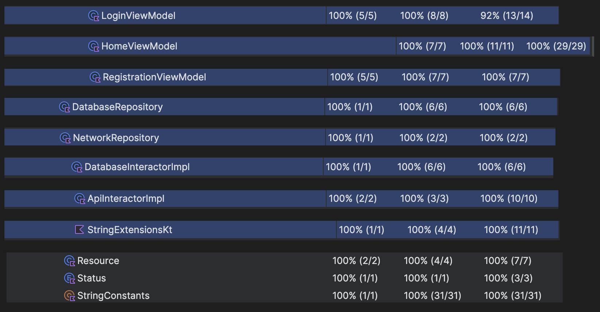
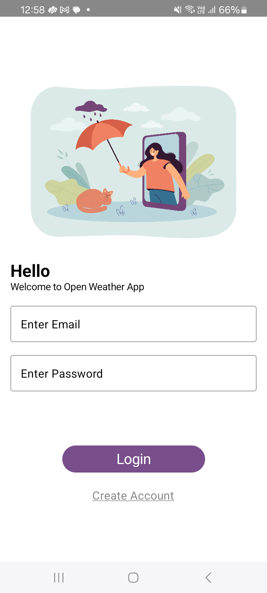
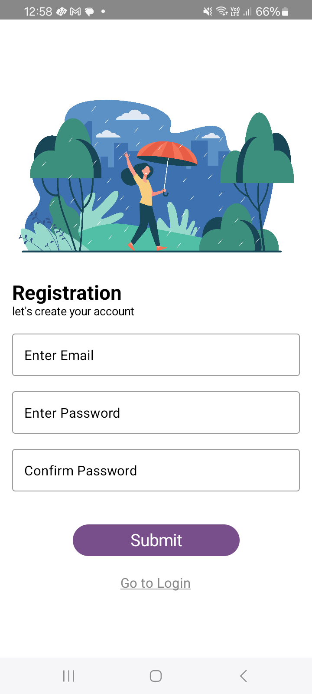
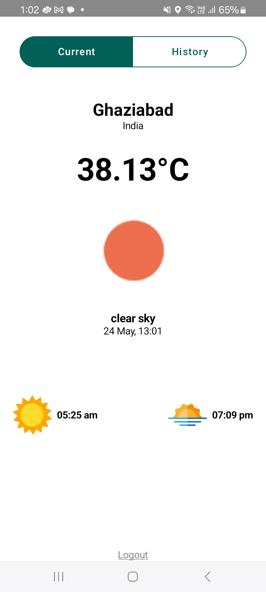
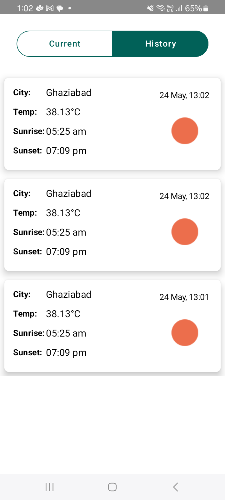

# OpenWeatherApp
OpenWeatherApp is an Android application built using Kotlin and designed with MVVM Clean architecture. This app fetches users live location after login or registration and show the current weather. Also it save the history of weather and shows a history list in history page. The app utilizes HILT for dependency injection, Compose for UI, Room for local database storage, Fused Location API for obtaining the current location, and the OpenWeatherMap API for fetching weather information. It also incorporates a Splash Screen API for a smooth startup experience.

## Features
#### - MVVM Clean Architecture: 
The application follows the MVVM architectural pattern with Clean Architecture principles, ensuring separation of concerns and maintainability.

#### - Compose for UI:
The UI is implemented using Jetpack Compose, providing a declarative and modern approach to building user interfaces.

#### - Compose Navigation:
Navigation within the app is managed using Compose Navigation, providing a seamless flow between screens.

#### - Dependency Injection with HILT: 
HILT is employed for dependency injection, facilitating the management of dependencies and promoting modularity.

#### - Room Database: 
Room is used for local database storage, allowing the app to persistently store weather information and user data.

#### - Fused Location API: 
The Fused Location API is utilized to determine the device's current location, enhancing the accuracy of weather data.

#### - OpenWeatherMap API: 
The OpenWeatherMap API is integrated to fetch current weather information based on the device's location.

#### - Splash Screen API: 
A Splash Screen is implemented to enhance the user experience during app startup.

#### - Login and Registration: 
The application includes screens for user login and registration, with local Room database storage for user credentials.

## Dependencies
- HILT
- Jetpack Compose
- Room Database
- Fused Location Provider
- OpenWeatherMap API
- Retrofit
- JUnit
- Kluent
- Mockito
- SqlCipher

## Unit Test
This repository provides a comprehensive unit testing setup for Android applications using JUnit, Mockito, and Kluent. The testing framework is designed to ensure the reliability, correctness, and maintainability of the application codebase.

### Key Components
#### - JUnit
JUnit is a widely used testing framework for Java and Kotlin applications. It provides annotations for defining test methods, assertions for validating expected outcomes, and test runners for executing the tests.

#### - Mockito
Mockito is a powerful mocking framework for Java and Kotlin. It allows the creation of mock objects to simulate dependencies, enabling isolated unit testing. Mockito works seamlessly with JUnit to facilitate effective testing of individual components.

#### - Kluent
Kluent is a fluent assertion library for Kotlin. It simplifies the process of writing assertions by providing a clear and concise syntax. Kluent enhances the readability of tests and promotes expressive assertions.

### Unit test results
Unit test results covers above 95% of code coverage.
- 

## Project Structure
The project is organized into the following directories:

### data
This directory encapsulates all data-related components. It includes subdirectories for various data models and operations:

#### - Location: 
Defines data models related to location.
#### - Api: 
Contains classes for handling API requests and responses.
#### - Database: 
Contains Data Access Object (DAO) and Entity classes for database operations.

### DI (Dependency Injection)
The DI directory manages dependency injection modules for different aspects of the application:

#### - Database Module: 
Handles dependency injection related to the database.
#### - Network Module: 
Manages dependency injection for network-related components.

### repository
The repository directory serves as the bridge between the data and the rest of the application. It is further divided into:

#### - Database Repository: 
Manages data interactions with the local database.
#### - Network Repository: 
Handles data interactions with remote APIs.
### resource
The resource directory is dedicated to utility classes that can be utilized across different parts of the application.

### feature
The feature directory is subdivided into specific features/modules of the application:

#### - Home: 
Contains files related to the home feature.
#### - Login: 
Contains files associated with user login functionality.
#### - Registration: 
Manages user registration-related components.
#### - Weather History: 
Encompasses files related to displaying weather history.
Each feature module consists of Compose UI (User Interface) and ViewModel components.

## Security

#### - SQLCipher Encryption in Room DB

Our application employs [SQLCipher](https://www.zetetic.net/sqlcipher/) for encrypting sensitive data stored in the Room Database. SQLCipher provides robust encryption mechanisms, ensuring the confidentiality of user data.

#### - ProGuard for Code Obfuscation

To enhance the security of our application, we utilize [ProGuard](https://www.guardsquare.com/products/proguard) for code obfuscation. ProGuard helps make reverse engineering more challenging, protecting sensitive code and assets from unauthorized access.


## Environment Details
#### Android Studio Version
This project is developed and tested on Android Studio version (Android Studio Jellyfish | 2023.3.1). Ensure that you are using a compatible version for seamless development.

#### Device Support
The application is designed and optimized for Android phones. Ensure that your target devices meet the Android version requirements specified in the project.


## Getting Started
Clone the repository: git clone https://github.com/krishnasharmma/OpenWeatherApp

Open the project in Android Studio.

### Adding API Key to `native-lib.cpp`
To integrate your API key you need to put OpenWeatherMap api key in base64 form into the `native-lib.cpp` file, follow these steps:
1. Open the `cpp/native-lib.cpp` file in your preferred text editor.
2. Locate the section where the API key needs to be added.
3. Replace the placeholder `ENTER Your Base64 Encode Api Key` with your actual API key encoded in base64.
4. Replace the placeholder `DB-Encryption-Key` with your key to encrypt the database.
5. Save the changes to the `native-lib.cpp` file.
```cpp
// cpp/native-lib.cpp

std::string api_key = "BASE64_API_KEY_HERE"; // Replace with your actual API key in base64
std::string api_key = "DB-Encryption-Key"; // Replace with your key to encrypt the database
// ...
```

Build and run the app on an emulator or physical device.

## Screens
### Login:
Allows users to log in with their credentials.
- 

### Registration:
Enables users to create a new account by providing the necessary registration details.
- 

### Home - Tab 1 (Current Weather):
Displays the current weather information based on the device's location obtained through Fused Location API and OpenWeatherMap API.
- 

### Home - Tab 2 (History Listing):
Shows a listing of weather history saved in the local Room database.
- 


## Contributing
Feel free to contribute to the WeatherAssignment project by opening issues, providing feedback, or submitting pull requests. Your contributions are highly appreciated. Being only contributor I have put all code in master directly.